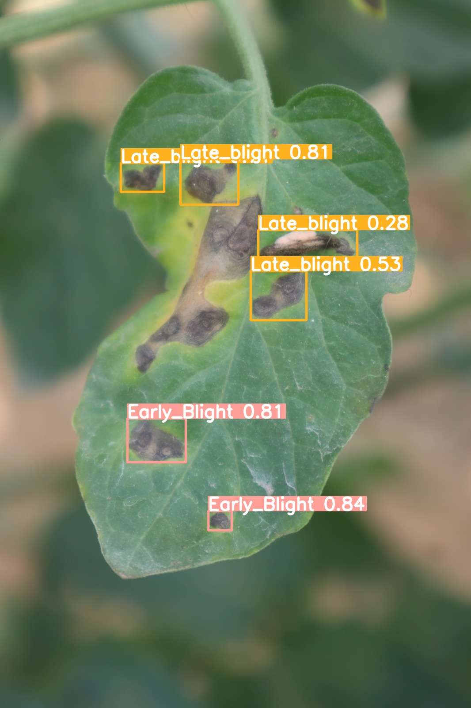
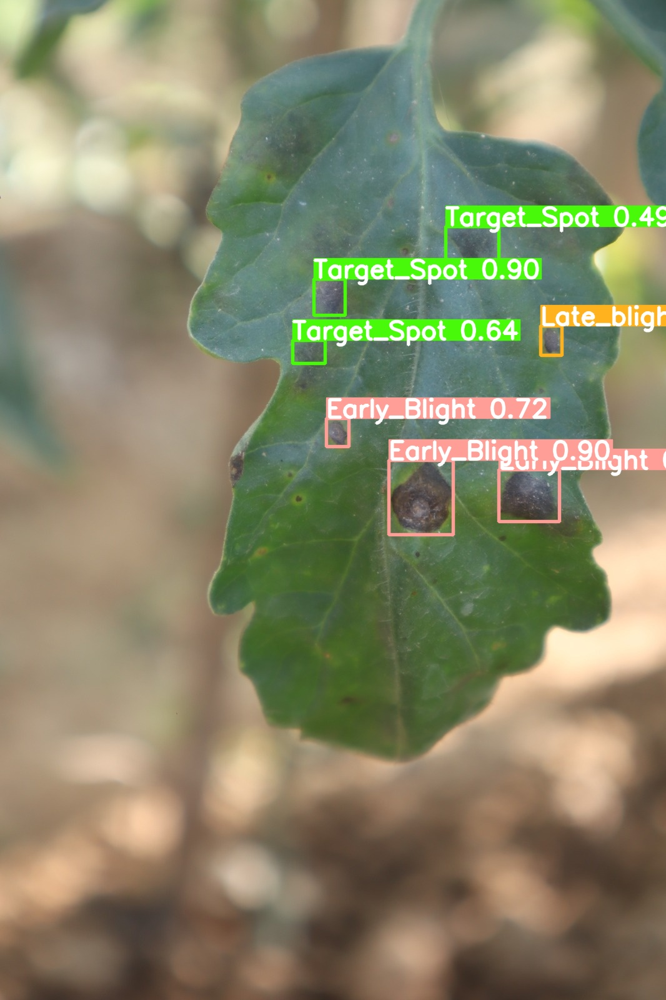

## Below are some predicted images:

  
  

## Dataset
You can find the dataset used in this project on Kaggle: [Tomato Leaf Diseases](https://www.kaggle.com/datasets/farukalam/tomato-leaf-diseases-detection-computer-vision)

## Tracking
Ripe and Unripe tomatoes tracking: [Source](https://www.linkedin.com/feed/update/urn:li:activity:7216078598800068610/)

https://github.com/user-attachments/assets/55879e31-6a9e-405f-9153-57fe4da20aeb

